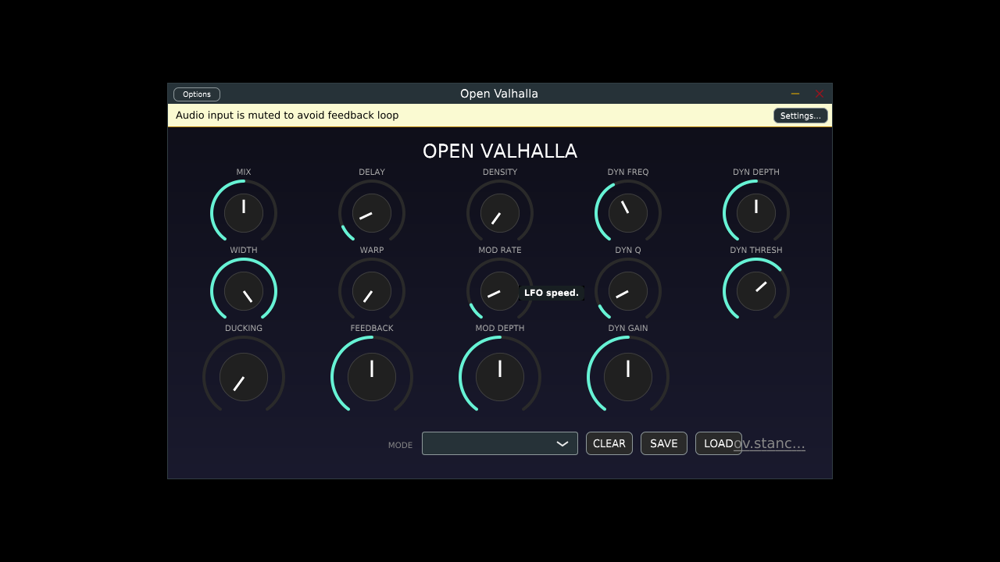

# Open Valhalla

An open-source, modular reverb engine offering high-fidelity algorithms inspired by classic space reverberators. Features deep modulation, multiple reverb modes, and VST3 compatibility.



## Features

*   **21 Unique Reverb Modes**: Ranging from fast echoes to massive lush spaces and looping delays.
*   **Modular DSP Chain**:
    *   **Pre-Delay**: Up to 2000ms with modulation.
    *   **Warp**: Controls the modulation feedback and character.
    *   **Reverb Core**: Feedback Delay Network (FDN) based reverb with feedback and density controls.
    *   **EQ**: Low and High cut filters to shape the tone.
*   **Deep Modulation**: Adjustable Rate and Depth for chorus-like textures or pitch-shifting tails.
*   **Custom UI**: Dark, flat design inspired by classic hardware and software units.

## Algorithms (Modes)

*   **Twin Star**: Fast attack, shorter decay, high echo density.
*   **Sea Serpent**: Fast-ish attack, shorter decay, varying density.
*   **Horse Man**: Medium attack, longer decay, medium-high density.
*   **Archer**: Slow attack, longer decay, high density.
*   **Void Maker**: Medium attack, very long decay, massive spaces.
*   **Galaxy Spiral**: Slowest attack, very long decay, very high density.
*   **Harp String, Goat Horn, Nebula Cloud, Triangle**: Various combinations of attack, decay, and echo patterns.
*   **Cloud Major/Minor**: Strange repeating patterns with low density.
*   **Queen Chair/Hunter Belt**: Low initial density building to massive reverbs.
*   **Water Bearer/Two Fish**: EchoVerb algorithms with audible delays morphing into reverb.
*   **Scorpion Tail, Balance Scale, Lion Heart, Maiden, Seven Sisters**: Complex feedback and filtering networks.

## Build Instructions

### Dependencies
*   **CMake** (3.15 or higher)
*   **C++ Compiler** (C++17 support)
*   **Linux Requirements**: `libwebkit2gtk-4.1-dev`, `libasound2-dev`, `libx11-dev`, `libfreetype6-dev`, `libcurl4-openssl-dev`.

### Building

#### Linux
```bash
cmake -B build -S . -DCMAKE_BUILD_TYPE=Release
cmake --build build --config Release
```

#### Windows
```cmd
cmake -B build -S .
cmake --build build --config Release
```

The VST3 plugin will be located in `build/VST3OpenValhalla_artefacts/VST3/` (Linux) or `build/VST3OpenValhalla_artefacts/Release/VST3/` (Windows).
The Standalone application will be in `build/VST3OpenValhalla_artefacts/Standalone/` (Linux) or `build/VST3OpenValhalla_artefacts/Release/Standalone/` (Windows).

### Automated Builds (CI)
This project uses GitHub Actions to automatically build releases for Windows and Linux. You can download the latest artifacts from the [Actions](https://github.com/YOUR_USERNAME/REPO_NAME/actions) tab (replace with actual repo URL) or from the Releases page if available.

## License

This project is open-source. JUCE is used under the GPLv3/Commercial license (check JUCE licensing terms).

## Credits

This is an educational recreation and tribute.
